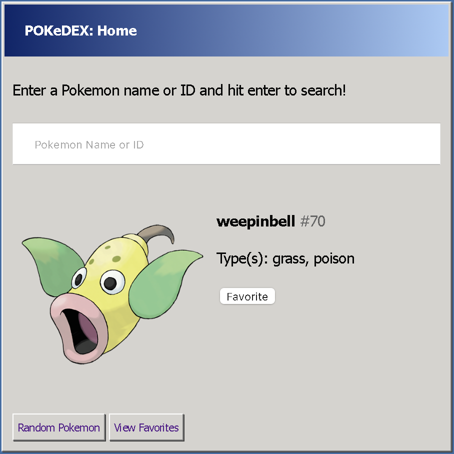
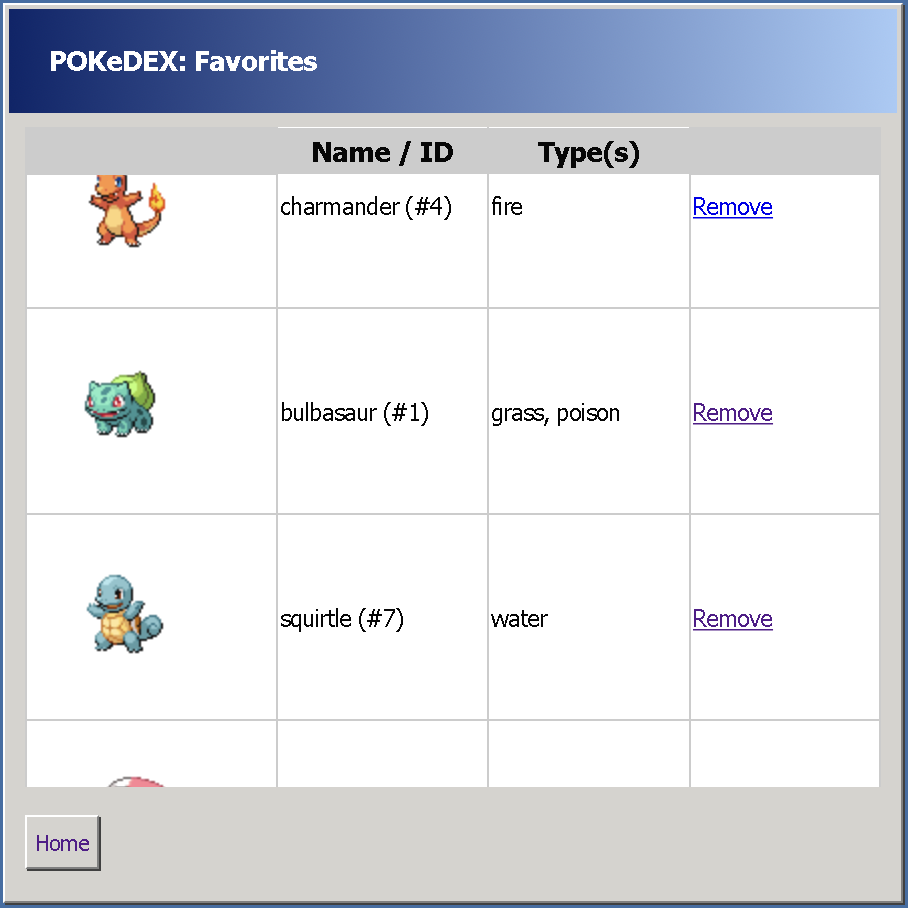

# PokemonAPIProject
SpringMVC application that utilizes the [RESTful Pokémon API](https://pokeapi.co).

# Features
- Search the entire Pokedex by name or ID
- Add and remove any Pokemon to your favorites (saved in a MongoDB repository)
- Nostalgic Windows 98 inspired design

# Screenshots
## Home

Displays a random Pokemon

## Favorites

Shows a list of all of the Pokemon the user has favorited.
